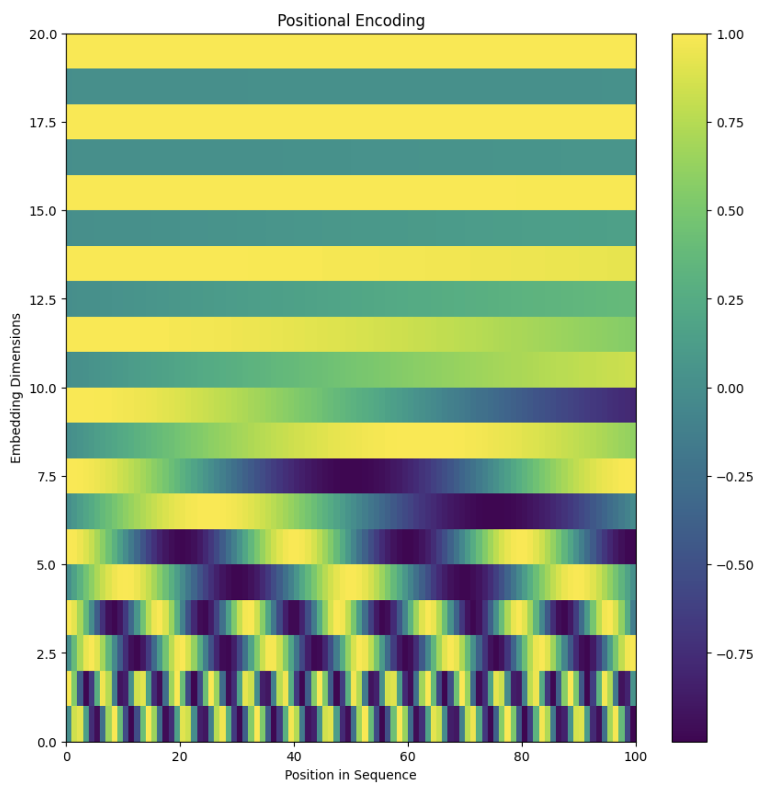

# Inside the Transformer

This repository implements the core building blocks of the Transformer architecture from scratch in PyTorch, inspired by the paper:

> "Attention is All You Need" - Vaswani et al., 2017

---

## Learning Objectives

By working through this codebase you will:

- Understand the internals of the Transformer architecture.
- Implement Scaled Dot Product Attention.
- Implement Multi Head Attention.
- Build a Transformer Encoder Block.
- Integrate sinusoidal Positional Encoding.
- Run small demos and generate visualizations for attention and positional encodings.

---

## Project Structure

```text
.
├── attention.py              # Scaled dot product attention (Section 1)
├── multi_head_attention.py   # Multi head attention module (Section 2)
├── encoder_block.py          # Transformer encoder block (Section 3)
├── positional_encoding.py    # Positional encoding module and plot helper (Section 4)
├── demo_encoder.py           # Minimal end-to-end encoder demo
├── demo_attention_viz.py     # Attention weights visualization
├── assets/
│   ├── positional_encoding.png   # Saved positional encoding heatmap
│   └── example_attention.png     # Saved attention weights heatmap
├── tests/
│   ├── test_attention.py
│   ├── test_multi_head.py
│   ├── test_encoder_block.py
│   └── test_positional_encoding.py
├── requirements.txt
├── .gitignore
└── README.md
```

---

## Installation

1. Clone this repository:

```bash
git clone https://github.com/ak811/inside-the-transformer.git
cd inside-the-transformer
```

2. (Optional) Create and activate a virtual environment.

3. Install dependencies:

```bash
pip install -r requirements.txt
```
---

## Components

### 1. Scaled Dot Product Attention

File: `attention.py`

Implements:

- `scaled_dot_product_attention(q, k, v, mask=None)`

Usage example:

```bash
python attention.py
```

This will:

- Create small test tensors `q`, `k`, `v`.
- Print the queries, keys, values, and the resulting attention weights and output values.

This corresponds to Section 1 of the lab (Scaled Dot Product Attention).

---

### 2. Multi Head Attention

File: `multi_head_attention.py`

Implements:

- `MultiHeadAttention(d_model, num_heads)`

Key ideas:

- Project input embeddings into query, key, value spaces.
- Split into multiple heads.
- Apply scaled dot product attention per head.
- Concatenate heads and apply a final linear projection.

Run the built-in demo:

```bash
python multi_head_attention.py
```

Expected output:

- Output shape: `(batch_size, seq_length, d_model)`
- Attention shape: `(batch_size, num_heads, seq_length, seq_length)`

This corresponds to Section 2 of the lab (Multi Head Attention).

---

### 3. Transformer Encoder Block

File: `encoder_block.py`

Implements a single encoder block:

- Multi head self attention
- Residual connections
- Layer normalization
- Position wise feed forward network

Run the built-in demo:

```bash
python encoder_block.py
```

Expected:

- Prints encoder output shape: `(batch_size, seq_length, d_model)`

This corresponds to Section 3 of the lab (Transformer Encoder Block).

---

### 4. Positional Encoding

File: `positional_encoding.py`

Implements:

- `PositionalEncoding(d_model, max_len=5000)`

Also includes a helper function:

- `save_positional_encoding_plot(d_model=20, max_len=100, out_path="assets/positional_encoding.png")`

Run:

```bash
python positional_encoding.py
```

This will:

- Generate a sinusoidal positional encoding matrix.
- Save a heatmap plot to `assets/positional_encoding.png`.

---

### 5. Minimal Transformer Encoder Demo

File: `demo_encoder.py`

Defines a small encoder stack:

- Token embedding
- Positional encoding
- Multiple `TransformerEncoderBlock` layers

Run:

```bash
python demo_encoder.py
```

This script:

- Creates a tiny vocabulary and random token ids.
- Runs them through the encoder.
- Prints input and output shapes.

It shows how the individual pieces combine into a simple Transformer encoder.

---

### 6. Attention Visualization

File: `demo_attention_viz.py`

Generates a heatmap of attention weights for a single head:

```bash
python demo_attention_viz.py
```

This will save a file:

- `assets/example_attention.png`

You can embed this in your README and use it for teaching or explanation of attention patterns.

---

## Visualizations For README

After running the plotting scripts, you will have:

- `assets/positional_encoding.png`  
- `assets/example_attention.png`

You can embed them in this README as follows:

```markdown
### Positional Encoding



```

These images help visualize what the model is doing under the hood.

---

## Tests

Basic tests are included in the `tests/` directory. They focus on shape correctness and simple sanity checks.

If you have `pytest` installed, you can run:

```bash
pytest
```

The tests verify:

- `scaled_dot_product_attention` returns correctly shaped outputs.
- `MultiHeadAttention` produces outputs and attention weights with expected shapes.
- `TransformerEncoderBlock` preserves the `(batch_size, seq_length, d_model)` shape.
- `PositionalEncoding` adds positional information without changing shape.

---

## References

- Vaswani et al., 2017: “Attention Is All You Need”
- The Illustrated Transformer - Jay Alammar
- PyTorch Official Tutorials: https://pytorch.org/tutorials/

---
